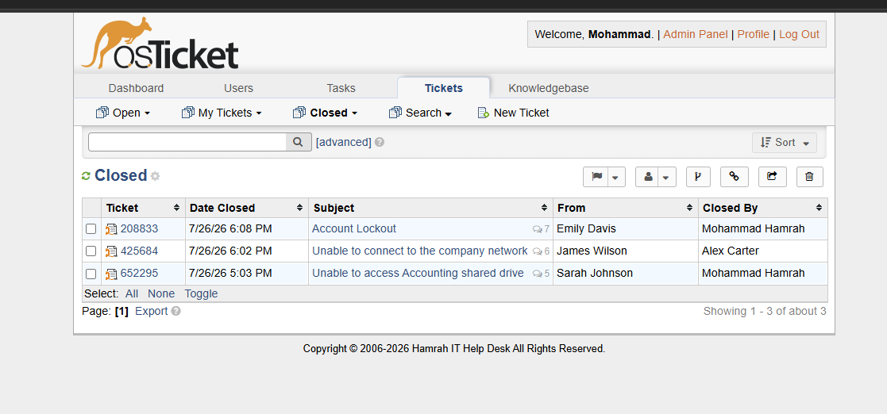
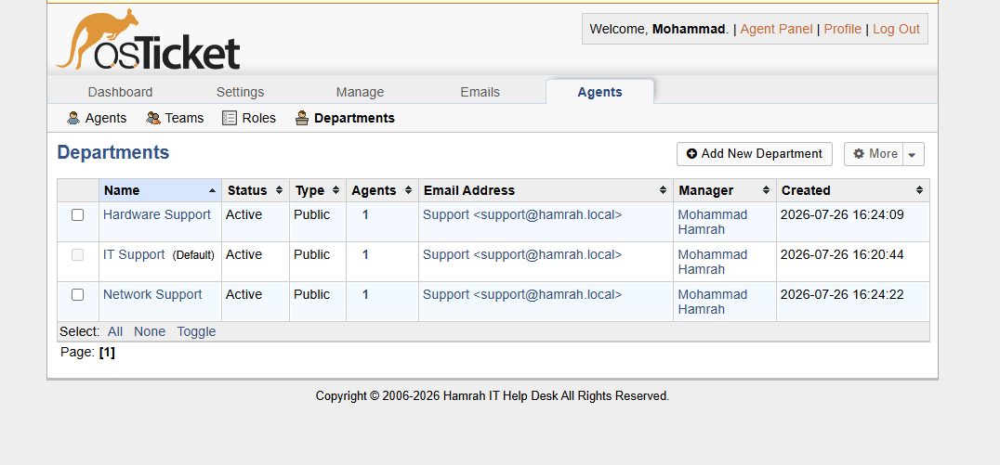
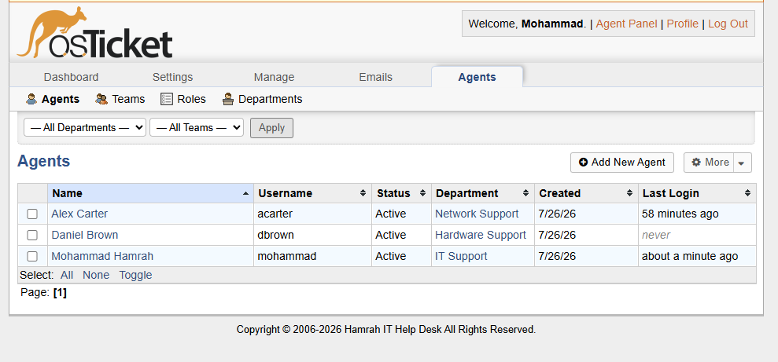

# IT Support Help Desk Lab

A hands-on IT support home lab built with **osTicket, XAMPP, MySQL, Windows, Active Directory, and PowerShell**.

This project was created to practice real-world help desk workflows, including ticket intake, ticket assignment, troubleshooting, user communication, documentation, and incident resolution.

## Project Overview

I built and configured a local osTicket help desk environment and created simulated IT support incidents based on common problems found in enterprise environments.

The lab includes:

* Help desk departments
* Support agents
* End users
* Help topics
* Ticket priorities
* Ticket assignment
* Internal notes
* Customer-facing responses
* Ticket resolution and closure
* Simulated Windows and Active Directory troubleshooting

## Technologies Used

* osTicket
* XAMPP
* Apache
* PHP 8.2
* MySQL
* Windows
* Active Directory
* PowerShell
* IPv4
* DHCP
* DNS

## Help Desk Configuration

### Departments

The help desk was organized into three support departments:

* **IT Support** — General IT and account-related issues
* **Network Support** — Network connectivity and VPN issues
* **Hardware Support** — Hardware and peripheral issues

### Help Topics

Help topics were created to categorize incoming support requests:

* Account Lockout
* Email Issue
* File & Share Access
* Hardware Issue
* Network Connectivity
* Password Reset
* Printer & Peripheral
* Security Incident
* Software Installation
* VPN Access

### Support Agents

The lab includes multiple simulated support agents assigned to different departments.

Agents were used to practice ticket assignment and department-based support workflows.

## Ticket Scenarios

### Ticket #1 — File & Share Access

**User:** Sarah Johnson
**Department:** IT Support
**Priority:** Normal

Sarah reported that she was receiving an "Access Denied" message when attempting to access an Accounting shared drive.

The ticket was used to practice:

* User verification
* Security group membership
* File and folder permissions
* Access troubleshooting
* Internal documentation
* User communication

[View Ticket #1 Documentation](tickets/01-file-share-access.md)

---

### Ticket #2 — Network Connectivity

**User:** James Wilson
**Department:** Network Support
**Priority:** High

James reported that his computer was connected to Wi-Fi but could not access company resources or the internet.

The issue involved an invalid `169.254.x.x` APIPA address and missing network configuration.

The ticket was used to practice:

* IPv4 troubleshooting
* APIPA
* DHCP
* DNS
* Default gateway troubleshooting
* Network connectivity testing
* Ticket documentation

[View Ticket #2 Documentation](tickets/02-network-connectivity.md)

---

### Ticket #3 — Account Lockout

**User:** Emily Davis
**Department:** IT Support
**Priority:** High

Emily reported that she could not log into her Windows workstation because her Active Directory account was locked.

The ticket was used to practice:

* Active Directory account management
* Account lockout troubleshooting
* PowerShell
* User verification
* Authentication troubleshooting
* Ticket documentation
* User communication

[View Ticket #3 Documentation](tickets/03-account-lockout.md)

## Screenshots

### osTicket Dashboard



### Departments



### Agents



### Help Topics


## Skills Demonstrated

### Help Desk

* Ticket triage
* Ticket assignment
* Incident documentation
* Internal notes
* Customer communication
* Ticket resolution
* Ticket closure
* Help topic categorization
* Department-based routing

### Windows & Identity

* Windows administration
* Active Directory
* Account management
* Security groups
* Authentication troubleshooting
* Access control
* PowerShell

### Networking

* IPv4
* DHCP
* DNS
* Default gateways
* APIPA
* Network troubleshooting
* Connectivity testing

## What I Learned

Through this lab, I practiced how an IT support technician handles an issue from start to finish:

1. Receive and categorize the user's request.
2. Verify the user's identity.
3. Identify the symptoms.
4. Troubleshoot the issue.
5. Document the troubleshooting process.
6. Communicate the resolution to the user.
7. Verify that the issue is resolved.
8. Close the ticket.

The lab also helped connect technical concepts such as **Active Directory, DHCP, DNS, permissions, and PowerShell** to realistic help desk scenarios.

## Lab Environment

This project was completed as a **simulated IT support environment in a personal home lab**.

The osTicket installation was hosted locally using XAMPP with Apache, PHP, and MySQL.

No real company systems, users, credentials, or confidential information were used.

## Future Improvements

Potential additions to the lab include:

* Microsoft Active Directory domain environment
* Windows Server domain controller
* Group Policy troubleshooting
* Password reset workflow
* VPN troubleshooting
* Hardware replacement ticket
* Software installation ticket
* SLA escalation scenarios
* Knowledge base articles
* More advanced PowerShell automation

## Project Structure

```text
it-support-helpdesk-lab/
│
├── README.md
│
├── Screenshots/
│   ├── dashboard.png
│   ├── agents.png
│   ├── departments.png
│   ├── help-topics.png
│   ├── ticket-1.png
│   ├── ticket-1-thread.png
│   ├── ticket-2.png
│   ├── ticket-2-thread.png
│   ├── ticket-3.png
│   └── ticket-3-thread.png
│
└── tickets/
    ├── 01-file-share-access.md
    ├── 02-network-connectivity.md
    └── 03-account-lockout.md
```
