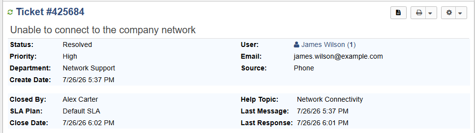
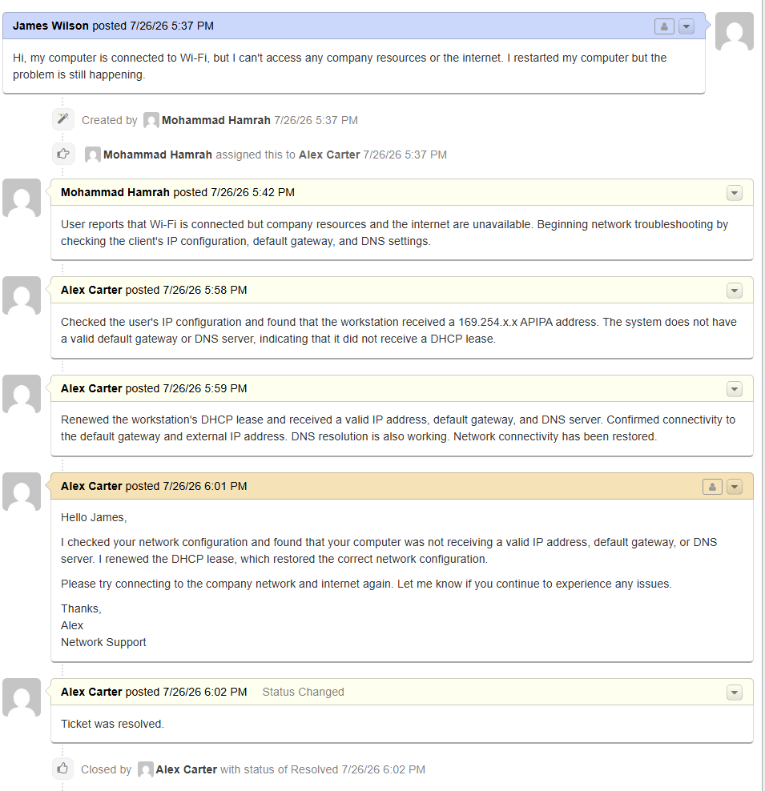

# Ticket #2 — Network Connectivity

## Overview

This ticket simulates a help desk incident involving a user who is connected to Wi-Fi but cannot access company resources or the internet.

The goal of this exercise was to practice network troubleshooting, DHCP troubleshooting, ticket documentation, user communication, and ticket resolution using osTicket.

## Ticket Information

| Field          | Details              |
| -------------- | -------------------- |
| Ticket Number  | #425684              |
| User           | James Wilson         |
| Help Topic     | Network Connectivity |
| Department     | Network Support      |
| Priority       | High                 |
| Assigned Agent | Alex Carter          |
| Source         | Phone                |
| Status         | Closed               |

## User Report

James Wilson reported that his computer was connected to Wi-Fi but could not access company resources or the internet.

> "Hi, my computer is connected to Wi-Fi, but I can't access any company resources or the internet. I restarted my computer but the problem is still happening."

## Troubleshooting Process

### 1. Verify the User

The user's identity was verified before beginning troubleshooting.

### 2. Check IP Configuration

The workstation's network configuration was checked using:

`ipconfig /all`

The workstation was found to have:

* A `169.254.x.x` IPv4 address
* No default gateway
* No DNS server

The `169.254.x.x` address indicated that the workstation had assigned itself an APIPA address because it was unable to obtain a valid DHCP lease.

### 3. Renew the DHCP Lease

The DHCP lease was released and renewed using:

`ipconfig /release`

`ipconfig /renew`

The workstation then received a valid:

* IPv4 address
* Subnet mask
* Default gateway
* DNS server

### 4. Test Network Connectivity

Connectivity to the default gateway was tested using `ping`.

External connectivity was tested using:

`ping 8.8.8.8`

DNS resolution was tested using:

`nslookup google.com`

The connectivity tests were successful.

## Root Cause

The workstation failed to obtain a valid DHCP lease and instead received an APIPA address.

Because the workstation did not receive a valid IP configuration, it also lacked a usable default gateway and DNS server.

## Resolution

The DHCP lease was renewed, allowing the workstation to obtain a valid network configuration.

Connectivity to the local gateway, external IP addresses, and DNS services was successfully verified.

## User Communication

The user was informed that the network configuration had been corrected and was asked to test network connectivity again.

The user confirmed that network connectivity was restored.

## Ticket Documentation

Internal notes were added to document the troubleshooting process and resolution.

The ticket was closed after the network issue was resolved.

## Skills Demonstrated

* osTicket ticket management
* Network troubleshooting
* IPv4
* APIPA
* DHCP
* DNS
* Default gateway
* IP configuration
* Network testing
* Ticket documentation
* User communication
* Incident resolution

## Screenshots

### Ticket

### Ticket Thread

## Lab Environment

This was completed as a simulated IT support scenario in a personal home lab using osTicket.

The scenario was designed to practice the troubleshooting workflow an IT support technician would use when a workstation is unable to obtain a valid network configuration.
