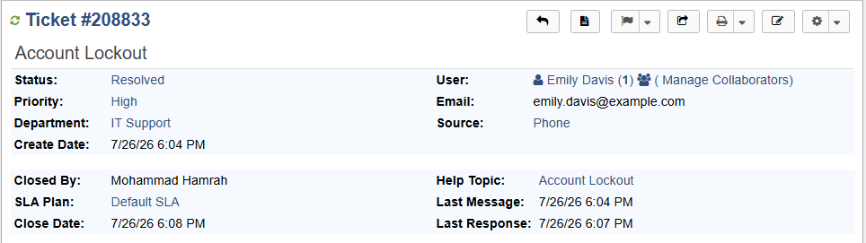
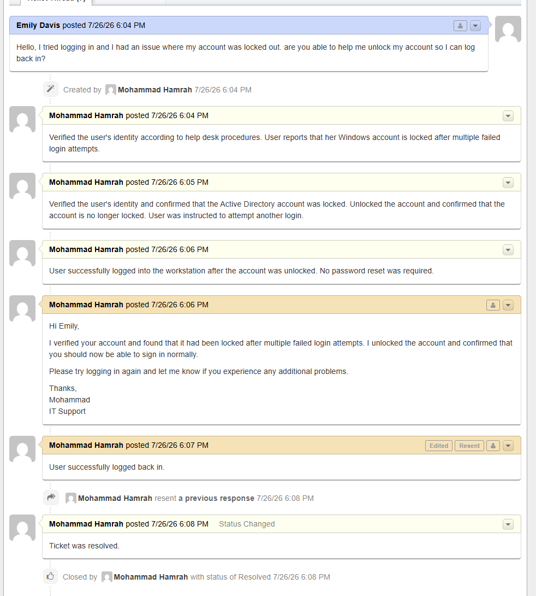

# Ticket #3 — Account Lockout

## Overview

This ticket simulates a help desk incident involving a user who is unable to log into their Windows workstation because their Active Directory account has been locked.

The goal of this exercise was to practice account troubleshooting, Active Directory administration, PowerShell, user verification, ticket documentation, user communication, and ticket resolution using osTicket.

## Ticket Information

| Field          | Details         |
| -------------- | --------------- |
| Ticket Number  | #208833         |
| User           | Emily Davis     |
| Help Topic     | Account Lockout |
| Department     | IT Support      |
| Priority       | High            |
| Assigned Agent | Mohammad Hamrah |
| Source         | Phone           |
| Status         | Closed          |

## User Report

Emily Davis reported that she was unable to log into her computer because her account had been locked.

> "Hello, I tried logging in and I had an issue where my account was locked out. Are you able to help me unlock my account so I can log back in?"

## Troubleshooting Process

### 1. Verify the User

The user's identity was verified before making any changes to the account.

### 2. Check the Account Status

The user's Active Directory account was checked to determine whether the account was locked.

PowerShell was used to check the account status:

`Get-ADUser edavis -Properties LockedOut`

The account was confirmed to be locked.

### 3. Unlock the Account

The account was unlocked using PowerShell:

`Unlock-ADAccount -Identity edavis`

The account status was then checked again:

`Get-ADUser edavis -Properties LockedOut`

The account was confirmed to no longer be locked.

### 4. Test User Login

Emily was instructed to attempt to log into her workstation again.

The user was able to successfully authenticate after the account was unlocked.

### 5. Check for Additional Issues

The user was informed that if the account becomes locked again, additional troubleshooting would be needed to determine what is causing repeated failed authentication attempts.

Possible causes could include:

* An old password saved on another device
* A mapped network drive using an old password
* An email application using outdated credentials
* A scheduled task using the user's account
* Another workstation attempting to authenticate with an old password

## Root Cause

The user's Active Directory account had been locked after multiple failed login attempts.

## Resolution

The Active Directory account was unlocked using PowerShell.

The user was able to successfully log into the workstation after the account was unlocked.

A password reset was not required because the user's existing password remained valid.

## User Communication

The user was informed that their account had been unlocked and was asked to test logging into the workstation.

The user confirmed that they were able to log in successfully.

## Ticket Documentation

Internal notes were added to document the account verification, troubleshooting, account unlock, and successful login test.

The ticket was closed after the user confirmed that access had been restored.

## Skills Demonstrated

* osTicket ticket management
* Active Directory
* PowerShell
* Account management
* Account lockout troubleshooting
* User verification
* Authentication troubleshooting
* Ticket documentation
* User communication
* Incident resolution

## Screenshots

### Ticket

### Ticket Thread

## Lab Environment

This was completed as a simulated IT support scenario in a personal home lab using osTicket.

The scenario was designed to practice the workflow an IT support technician would use when troubleshooting an Active Directory account lockout.

